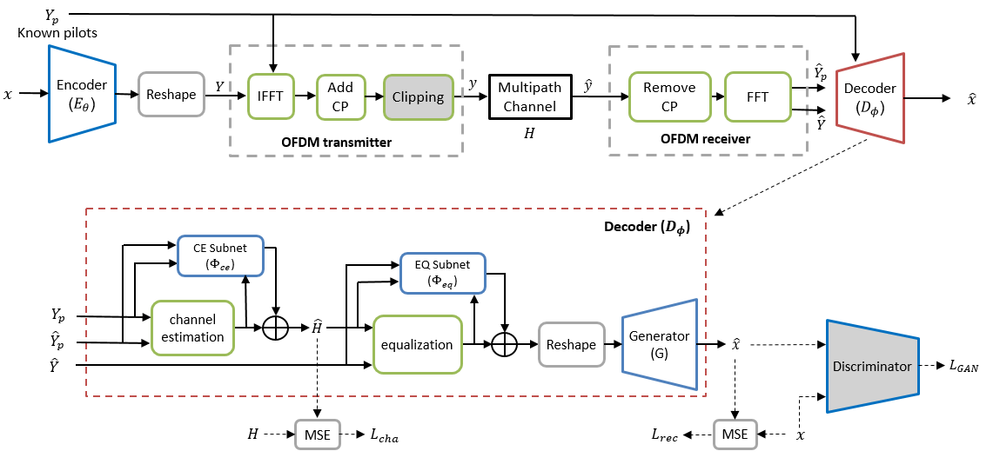

# OFDM-guided-JSCC
This is the code for paper for [OFDM-guided Deep Joint Source Channel Coding for Wireless Multipath Fading Channels](https://arxiv.org/abs/2109.05194), which is a journal version of [Deep Joint Source Channel Coding for WirelessImage Transmission with OFDM](https://arxiv.org/abs/2101.03909). 

## Dataset

`CIFAR-10` and `CIFAR-100` will be downloaded after the first run.

`CelebA` can be downloaded [here]() and should be placed at `dataset/celeba/CelebA_train` and `dataset/celeba/CelebA_test`. 

`OpenImage` can be donwloaded [here](https://storage.googleapis.com/openimages/web/index.html).

## Usage

Please edit the files under `configs` to test different schemes.

    __C.name                                         = 'JSCC_OFDM'      # Name of the experiment
    __C.gpu_ids                                      = [1]              # GPUs to use
    __C.dataset_mode                                 = 'OpenImage'  # ['CIFAR10', 'CIFAR100', 'CelebA', 'OpenImage']
    __C.checkpoints_dir                              = './Checkpoints/' + __C.dataset_mode   # Path to store the model
    __C.model                                        = 'JSCCOFDM'
    __C.C_channel                                    = 12         # Number of channels for output latents (controls the communication rate)
                                                                  # Calculation of the rate (channel usage per pixel): 
                                                                  #           C_channel / (3 x 2^(2 x n_downsample + 1))                                                         
    __C.SNR                                          = 5          # Signal to noise ratio
    __C.SNR_cal                                      = 'ins'      # ['ins', 'avg']. 'ins' is for instantaneous SNR, 'avg' is for average SNR
    __C.feedforward                                  = 'OFDM-CE-sub-EQ-sub'  # Different schemes: 
                                                                         # OFDM-CE-EQ: MMSE channel estimation and equalization without any subnets
                                                                         # OFDM-CE-sub-EQ: MMSE channel estimation and equalization with CE subnet
                                                                         # OFDM-CE-sub-EQ-sub: MMSE channel estimation and equalization with CE & EQ subnet
                                                                         # OFDM-feedback: pre-coding scheme with CSI feedback
    __C.N_pilot                                      = 1          # Number of pilot symbols
    __C.is_clip                                      = False      # Whether to apply signal clipping or not
    __C.CR                                           = 1.2        # Clipping ratio if clipping is applied
    __C.lam_h                                        = 50         # Weight for the channel reconstruction loss
    __C.gan_mode                                     = 'none'     # ['wgangp', 'lsgan', 'vanilla', 'none']
    __C.lam_G                                        = 0.02       # Weight for the adversarial loss
    __C.lam_L2                                       = 100        # Weight for image reconstruction loss

Run `train.py` to train the model. The trained model will be saved under `Checkpoints`.

Run `test.py` to test the model. Some recovered images will be saved under `Images`.

## Reference

    @misc{yang2021ofdmguided,
      title={OFDM-guided Deep Joint Source Channel Coding for Wireless Multipath Fading Channels}, 
      author={Mingyu Yang and Chenghong Bian and Hun-Seok Kim},
      year={2021},
      eprint={2109.05194},
      archivePrefix={arXiv},
      primaryClass={eess.SP}
    }
    
    
    @INPROCEEDINGS{9500996,
      author={Yang, Mingyu and Bian, Chenghong and Kim, Hun-Seok},
      booktitle={ICC 2021 - IEEE International Conference on Communications}, 
      title={Deep Joint Source Channel Coding for Wireless Image Transmission with OFDM}, 
      year={2021},
      volume={},
      number={},
      pages={1-6},
      doi={10.1109/ICC42927.2021.9500996}
     }
